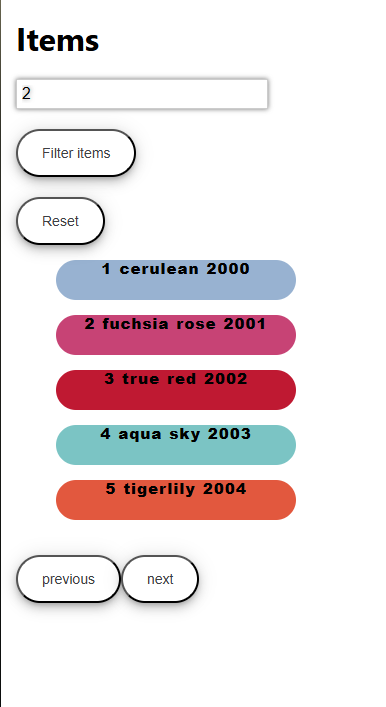

# 🛍️ ReqRes Products Viewer

A small React + Redux Toolkit exercise that fetches products from the [ReqRes API](https://reqres.in/api/products).  

## Features
- Fetch **10 products** from the API.
- Display **5 products per page** with **Prev** and **Next** buttons to navigate.
- **Filter products** to display a single product out of the 10.
- Built with **React**, **Redux Toolkit**, and **MUI** for styling.

## Screenshots


## How to Run
1. Clone the repo:
```bash
git clone <your-repo-url>
Install dependencies:

bash
cd <project-folder>
npm install
Start the React app:

bash
npm start
Notes
Uses x-api-key: reqres-free-v1 header for the ReqRes API.

Practiced pagination, filtering, and API integration in React.
